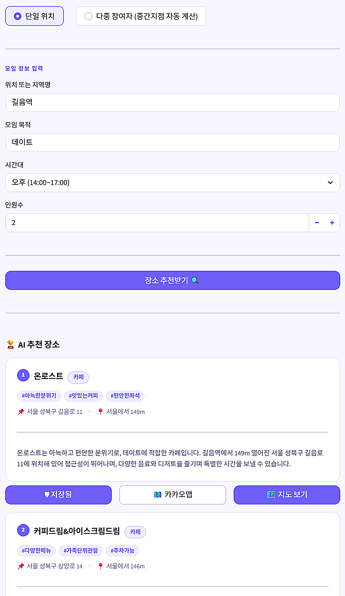
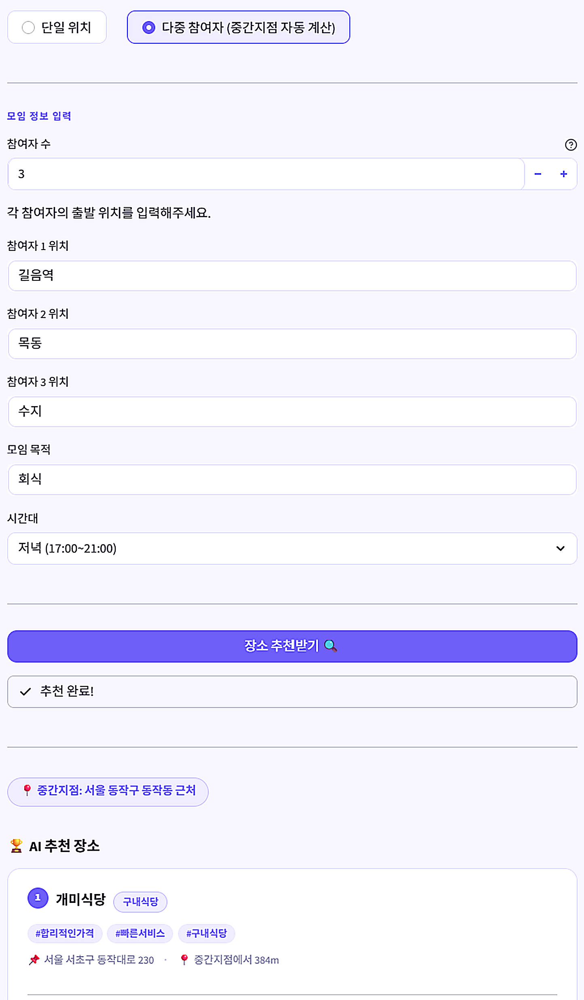
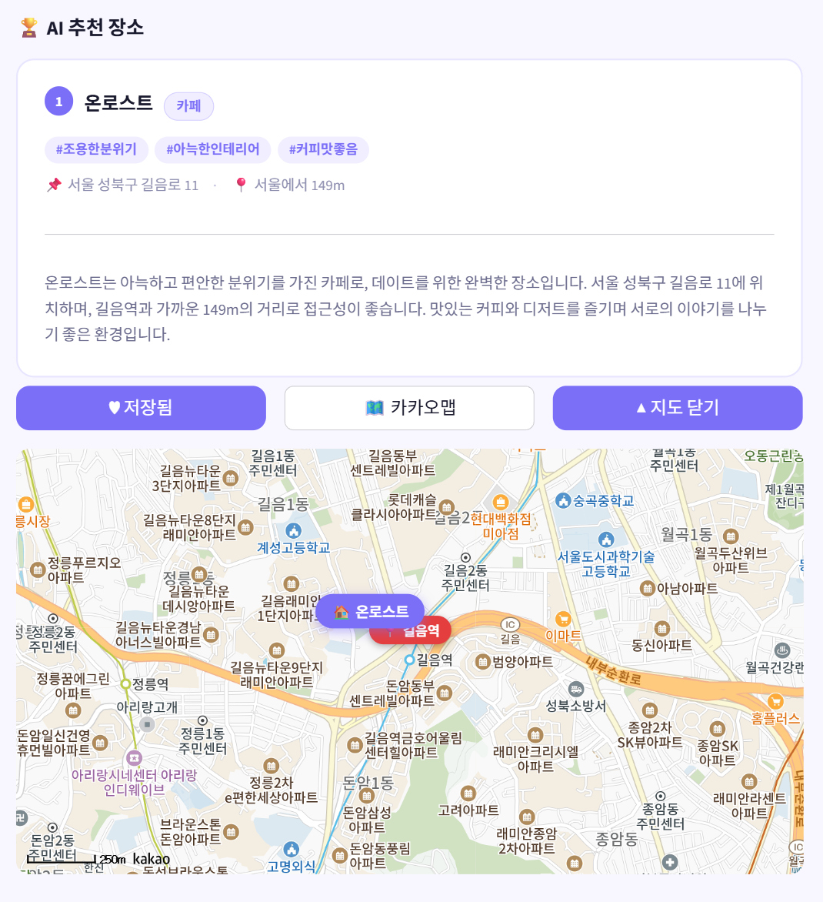
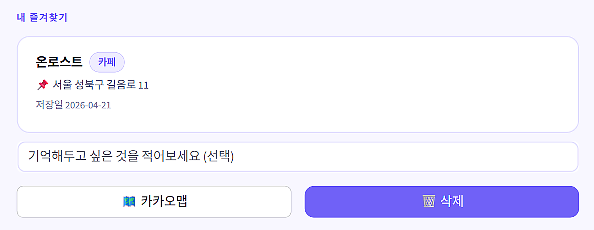
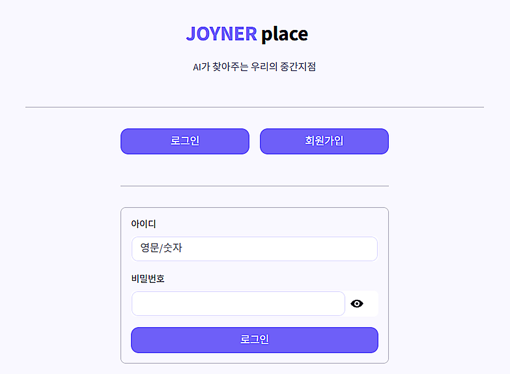
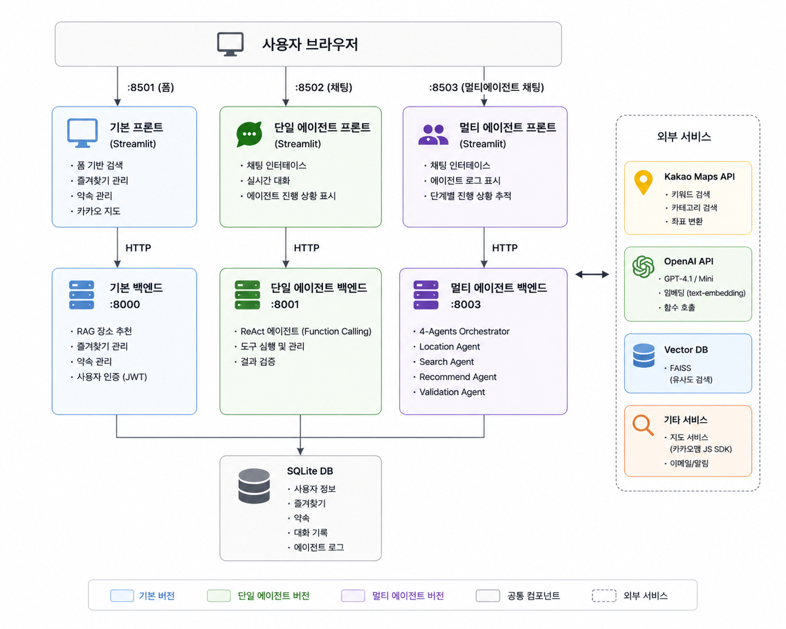

# JOYNER Place

> AI 기반 모임 장소 추천 서비스 — Kakao Maps + RAG + GPT

<p align="center">
  
</p>

<p align="center">
  
  
  
  
  
</p>

---

## 문제 정의

JOYNER는 AI 에이전트 간 자율 협상(A2A)으로 다중 참여자의 일정을 자동 조율하는 서비스입니다.

일정이 확정되는 순간, 자연스럽게 다음 질문이 생깁니다.

> **"그래서 우리 어디서 만나?"**

기존 방식은 여전히 수동입니다. 참여자가 각자 카카오맵·네이버지도를 열고, 장소를 검색하고, 단체 채팅방에 링크를 뿌리고, 또 다시 조율합니다. 일정 조율을 AI로 해결했지만 장소 결정은 여전히 사람이 반복 소통해야 하는 문제가 남아 있습니다.

특히 두 가지 상황이 반복적으로 불편합니다.

**1. 한 장소 기준 모임**
목적과 분위기에 맞는 장소를 직접 검색해야 하고, 인원·시간대·카테고리 조건을 모두 따져가며 고르는 데 상당한 시간이 걸립니다.

**2. 여러 곳에서 오는 모임**
참여자들이 서로 다른 지역에서 올 때 "어디가 중간이지?"를 계산하고, 그 주변에서 장소까지 찾는 과정이 이중으로 번거롭습니다.

---

## 해결 방향

**JOYNER Place**는 이 문제를 AI 파이프라인으로 자동화합니다.

자연어 한 문장만 입력하면 위치 파악 → 장소 검색 → 품질 검증 → 추천 이유 생성까지 모든 과정이 자동으로 처리됩니다.

```
"강남역이랑 홍대입구 중간에서 6명이서 저녁 고깃집"
         │
         ▼
  📍 중간지점 자동 계산 (공덕역 인근)
         │
         ▼
  🔍 Kakao API + FAISS + BM25 하이브리드 검색
         │
         ▼
  🤖 GPT 카테고리 필터링 + 맞춤 추천 이유 생성
         │
         ▼
  ✅ 규칙 기반 + LLM 품질 검증
         │
         ▼
  🗺️ 상위 5곳 추천 + 카카오 지도
```

**핵심 원칙 세 가지**

| 원칙 | 내용 |
|------|------|
| **자연어 입력** | 조건을 폼으로 채울 필요 없이 말하듯 입력 |
| **중간지점 자동화** | 여러 출발지를 입력하면 최적 중간지점을 계산해 그 주변을 탐색 |
| **근거 있는 추천** | GPT가 생성한 이유가 실제 장소 데이터에 기반하는지 LLM으로 재검증 |

---

## 트레이드오프 및 설계 결정

### 3-1. Multi-Agent 파이프라인 vs. Single Agent

| 항목 | Single Agent | Multi-Agent 파이프라인 (채택) |
|------|-------------|------------------------------|
| 구조 | GPT 하나가 도구를 자율 선택 | 4개 전문 에이전트 순차 실행 |
| 예측 가능성 | 낮음 (GPT가 순서를 임의 결정) | 높음 (고정 파이프라인) |
| 디버깅 | 어느 단계 실패인지 파악 어려움 | 단계별 로그로 실패 지점 즉시 파악 |
| 재시도 전략 | 에이전트 자체 판단 | 오케스트레이터가 Search → Recommend → Validate만 재실행 |
| 응답 속도 | 단순 요청에 빠름 | 모든 요청이 4단계를 거쳐야 함 |
| 품질 보증 | 검증 단계 생략 가능성 있음 | 검증 에이전트가 항상 실행됨 |

**채택 이유**: 초기 Single Agent 구현에서 GPT가 도구 실행 순서를 임의로 바꾸거나 위치 파싱 없이 검색을 시도하는 문제가 반복됐습니다. Multi-Agent 파이프라인으로 전환하자 각 에이전트가 하나의 책임만 가지므로 실패 지점이 즉시 드러났고, 오케스트레이터가 재시도 범위를 `Search → Recommend → Validate`로 한정해 불필요한 위치 재파싱 없이 효율적인 재시도가 가능해졌습니다.

---

### 3-2. 키워드 검색 단독 vs. 하이브리드 RAG

| 항목 | Kakao 키워드 검색 단독 | FAISS + BM25 하이브리드 (채택) |
|------|----------------------|-------------------------------|
| 추상적 표현 처리 | 불가 ("분위기 좋은 고깃집" 등) | FAISS 임베딩으로 처리 |
| 정확도 | 장소명·카테고리 정확 매칭 강함 | BM25로 정확 매칭 보완 |
| 검색 결과 안정성 | 동일 쿼리에도 순위 변동 | 두 결과 병합으로 안정적 순위 |
| 응답 속도 | 빠름 | 매 요청마다 FAISS 인덱스 빌드로 느림 |
| 다양성 | 제한적 | 의미 검색 + 키워드 검색 결합으로 다양성 확보 |

**채택 이유**: Kakao Maps API 키워드 검색만으로는 "분위기 좋은", "조용한" 같은 추상적 요건을 처리할 수 없었습니다. FAISS 의미 검색과 BM25 키워드 검색을 결합한 하이브리드 방식으로 두 가지 한계를 동시에 보완했습니다. 매 요청마다 FAISS 인덱스를 새로 빌드하는 비용이 있지만, Kakao API 결과가 요청 시점마다 달라지기 때문에 사전 인덱싱보다 실시간 빌드가 더 정확합니다.

---

### 3-3. GPT 출력: 장소명 직접 출력 vs. 인덱스 번호

| 항목 | 장소명 직접 출력 | 인덱스 번호 출력 (채택) |
|------|----------------|----------------------|
| 환각 위험 | 높음 (없는 장소명 생성 가능) | 없음 (후보 번호만 참조) |
| 결과 신뢰도 | 낮음 | 높음 (항상 실제 Kakao 데이터 기반) |
| 파싱 복잡도 | 높음 (장소명 문자열 매칭 필요) | 낮음 (숫자만 파싱) |
| 출력 형식 제어 | 어려움 | 쉬움 (정수 범위 검증만 필요) |

**채택 이유**: 초기에 GPT에게 추천 장소명을 직접 출력하도록 했을 때, 후보 목록에 없는 장소를 만들어내거나 장소명을 살짝 바꿔서 반환하는 환각 문제가 발생했습니다. GPT가 후보 목록의 번호(인덱스)만 출력하도록 프롬프트를 변경하자 환각이 원천 차단됐고, 파싱 로직도 단순해졌습니다.

---

### 3-4. 중간지점 탐색: 좁은 반경 단일 검색 vs. 넓은 반경 + 참여자 보조 검색

| 항목 | 중간지점 2km 단일 검색 | 5km 반경 + 참여자 좌표 보조 검색 (채택) |
|------|----------------------|--------------------------------------|
| 후보 수 (밀집 지역) | 충분 | 충분 |
| 후보 수 (저밀도 지역) | 극히 부족 (주거지·공원 인근) | 안정적으로 확보 |
| 검색 커버리지 | 중간지점 주변만 | 중간지점 + 각 참여자 출발지 |
| API 호출 횟수 | 적음 | 참여자 수에 비례해 증가 |
| 형평성 | 중간지점 편향 | 참여자 접근성 고려 |

**채택 이유**: 중간지점이 공원, 주거 단지, 강변 인근에 떨어지는 경우 2km 반경 검색으로는 후보가 3개 미만이 되는 문제가 반복됐습니다. 반경을 5km로 확장하고, 각 참여자 출발지에서도 보조 검색을 수행한 뒤 결과를 합산·중복 제거하는 방식으로 충분한 후보 풀을 확보했습니다.

---

## 주요 기능

| 기능 | 설명 |
|------|------|
| **자연어 입력** | 위치 · 목적 · 인원 · 시간대를 자유롭게 입력 |
| **중간지점 계산** | 여러 출발지 입력 시 자동으로 중간지점 계산 |
| **하이브리드 검색** | Kakao API + FAISS(의미 검색) + BM25(키워드) 결합 |
| **GPT 추천 이유** | 각 장소에 맞춤형 추천 이유 생성 |
| **품질 검증** | 규칙 기반 + LLM 검증으로 부적절한 추천 필터링 |
| **즐겨찾기** | 마음에 드는 장소 저장 및 메모 관리 |
| **약속 관리** | 모임 생성 · 초대 · 참석 여부 관리 |
| **카카오 지도** | 추천 결과를 지도에서 바로 확인 |

---

## 스크린샷

### 추천 결과

<table>
  <tr>
    <td align="center" width="50%">
      
      <br/><b>단일 위치 추천</b>
    </td>
    <td align="center" width="50%">
      
      <br/><b>중간지점 추천</b>
    </td>
  </tr>
</table>

### 카카오 지도 & 즐겨찾기

<table>
  <tr>
    <td align="center" width="50%">
      
      <br/><b>카카오 지도</b>
    </td>
    <td align="center" width="50%">
      
      <br/><b>즐겨찾기</b>
    </td>
  </tr>
</table>

### 로그인

<p align="center">
  
</p>

---

## 아키텍처

```
┌─────────────────────────────────────────────────────────┐
│                     사용자 브라우저                        │
└──────┬─────────────────┬──────────────────┬─────────────┘
       │                 │                  │
   :8501 (폼)       :8502 (채팅)        :8503 (멀티에이전트 채팅)
       │                 │                  │
┌──────▼──────┐  ┌───────▼──────┐  ┌───────▼───────────────┐
│  기본 프론트  │  │ 단일 에이전트  │  │   멀티 에이전트 프론트  │
│  (Streamlit) │  │  프론트       │  │    (Streamlit)        │
└──────┬───────┘  └───────┬──────┘  └───────┬───────────────┘
       │                  │                  │
  HTTP │             HTTP │             HTTP │
       │                  │                  │
┌──────▼────────┐  ┌──────▼────────┐  ┌─────▼─────────────────┐
│  기본 백엔드   │  │ 단일 에이전트  │  │    멀티 에이전트 백엔드   │
│  :8000        │  │  백엔드 :8001  │  │    :8003               │
│  - RAG 추천   │  │  - Function   │  │    - Location Agent    │
│  - 즐겨찾기   │  │    Calling    │  │    - Search Agent      │
│  - 약속 관리  │  │  - 도구 실행   │  │    - Recommend Agent   │
│  - 인증       │  │  - 검증       │  │    - Validation Agent  │
└──────┬────────┘  └───────────────┘  └────────────────────────┘
       │
   SQLite DB
```

<p align="center">
  
</p>

---

## 버전 안내

이 레포지토리는 세 가지 구현을 포함합니다.

### 기본 버전 (`/backend`, `/frontend`)
- 폼 기반 UI로 직접 조건 입력
- RAG 파이프라인으로 장소 검색 및 추천
- SQLite 기반 즐겨찾기·약속 관리

### Single Agent 버전 (`/agent`) — [자세히 보기](agent/README.md)
- 채팅 UI에서 자연어로 대화
- OpenAI Function Calling 기반 ReAct 에이전트
- 에이전트가 도구를 스스로 선택하고 반복 실행

### Multi-Agent 버전 (`/multi_agent`) — [자세히 보기](multi_agent/README.md)
- 4개 전문 에이전트가 순차 파이프라인으로 협업
- 오케스트레이터가 에이전트 실행 관리 및 재시도
- 에이전트 로그로 각 단계 투명하게 추적

---

## 기술 스택

| 분류 | 기술 |
|------|------|
| **프론트엔드** | Streamlit, Kakao Maps JS SDK |
| **백엔드** | FastAPI, Uvicorn |
| **인증** | JWT, bcrypt |
| **데이터베이스** | SQLite |
| **장소 검색** | Kakao Maps API |
| **벡터 검색** | OpenAI Embeddings, FAISS |
| **키워드 검색** | BM25 (rank-bm25) |
| **AI** | OpenAI GPT-4.1, GPT-4.1-mini |
| **컨테이너** | Docker, Docker Compose |

---

## 빠른 시작

### 사전 준비

- Docker & Docker Compose
- OpenAI API 키
- Kakao REST API 키

### 환경 변수 설정

```bash
cp .env.example .env
```

`.env` 파일을 열어 아래 항목을 채웁니다.

```env
OPENAI_API_KEY=sk-...
KAKAO_REST_API_KEY=...
SECRET_KEY=your-jwt-secret
```

### 실행

```bash
docker-compose up --build
```

| 서비스 | URL |
|--------|-----|
| 기본 UI | http://localhost:8501 |
| Single Agent 채팅 | http://localhost:8502 |
| Multi-Agent 채팅 | http://localhost:8503 |
| 기본 API 문서 | http://localhost:8000/docs |
| Single Agent API 문서 | http://localhost:8001/docs |
| Multi-Agent API 문서 | http://localhost:8003/docs |

---

## 프로젝트 구조

```
joyner_place/
├── backend/              # 기본 RAG 백엔드 (port 8000)
│   ├── main.py           # FastAPI 앱 & 라우터
│   ├── retrieval.py      # RAG 파이프라인
│   ├── indexing.py       # FAISS/BM25 인덱스 구성
│   ├── auth.py           # JWT 인증
│   ├── database.py       # SQLite 연동
│   ├── favorites.py      # 즐겨찾기 관리
│   └── appointment.py    # 약속 관리
├── frontend/             # 기본 Streamlit UI (port 8501)
├── agent/                # Single Agent 버전
│   ├── backend/          # Function Calling 에이전트 (port 8001)
│   └── frontend/         # 채팅 UI (port 8502)
├── multi_agent/          # Multi-Agent 버전
│   ├── backend/          # 4-에이전트 오케스트레이터 (port 8003)
│   ├── frontend/         # 채팅 UI (port 8503)
│   └── evaluation/       # 평가 파이프라인
├── evaluation/           # 기본 버전 평가
├── data/                 # SQLite DB
└── docker-compose.yml    # 전체 스택 실행
```

---

## 라이선스

MIT License
