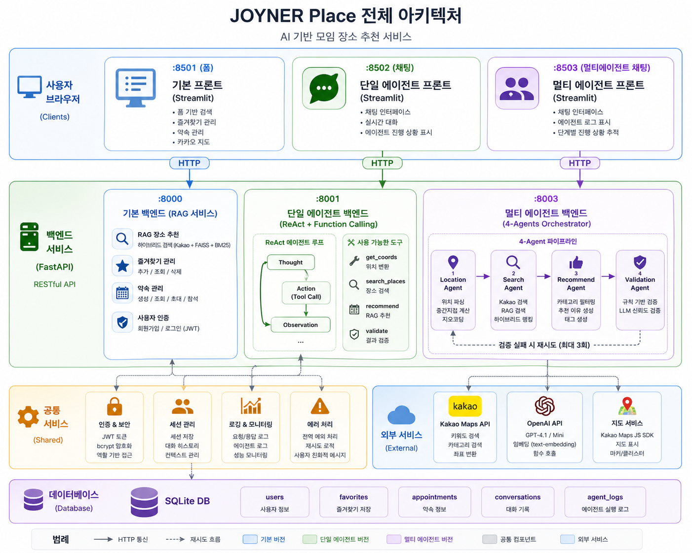

# JOYNER Place

> AI 기반 모임 장소 추천 서비스 — Kakao Maps + RAG + GPT

<p align="center">
  
</p>

<p align="center">
  
  
  
  
  
</p>

---

## 소개

**JOYNER Place**는 자연어 입력만으로 모임에 딱 맞는 장소를 찾아주는 AI 추천 서비스입니다.

"강남역 근처 5명이서 저녁 고깃집 추천해줘"처럼 말하면 Kakao Maps 검색 · 벡터 유사도 검색(RAG) · GPT 추천 이유 생성까지 자동으로 처리합니다.

<p align="center">
  
</p>

---

## 주요 기능

| 기능 | 설명 |
|------|------|
| **자연어 입력** | 위치 · 목적 · 인원 · 시간대를 자유롭게 입력 |
| **중간지점 계산** | 여러 출발지 입력 시 자동으로 중간지점 계산 |
| **하이브리드 검색** | Kakao API + FAISS(의미 검색) + BM25(키워드) 결합 |
| **GPT 추천 이유** | 각 장소에 맞춤형 추천 이유 생성 |
| **품질 검증** | 규칙 기반 + LLM 검증으로 부적절한 추천 필터링 |
| **즐겨찾기** | 마음에 드는 장소 저장 및 메모 관리 |
| **약속 관리** | 모임 생성 · 초대 · 참석 여부 관리 |
| **카카오 지도** | 추천 결과를 지도에서 바로 확인 |

---

## 아키텍처

```
┌─────────────────────────────────────────────────────────┐
│                     사용자 브라우저                        │
└──────┬─────────────────┬──────────────────┬─────────────┘
       │                 │                  │
   :8501 (폼)       :8502 (채팅)        :8503 (멀티에이전트 채팅)
       │                 │                  │
┌──────▼──────┐  ┌───────▼──────┐  ┌───────▼───────────────┐
│  기본 프론트  │  │ 단일 에이전트  │  │   멀티 에이전트 프론트  │
│  (Streamlit) │  │  프론트       │  │    (Streamlit)        │
└──────┬───────┘  └───────┬──────┘  └───────┬───────────────┘
       │                  │                  │
  HTTP │             HTTP │             HTTP │
       │                  │                  │
┌──────▼────────┐  ┌──────▼────────┐  ┌─────▼─────────────────┐
│  기본 백엔드   │  │ 단일 에이전트  │  │    멀티 에이전트 백엔드   │
│  :8000        │  │  백엔드 :8001  │  │    :8003               │
│  - RAG 추천   │  │  - Function   │  │    - Location Agent    │
│  - 즐겨찾기   │  │    Calling    │  │    - Search Agent      │
│  - 약속 관리  │  │  - 도구 실행   │  │    - Recommend Agent   │
│  - 인증       │  │  - 검증       │  │    - Validation Agent  │
└──────┬────────┘  └───────────────┘  └────────────────────────┘
       │
   SQLite DB
```

<p align="center">
  
</p>

---

## 버전 안내

이 레포지토리는 세 가지 구현을 포함합니다.

### 기본 버전 (`/backend`, `/frontend`)
- 폼 기반 UI로 직접 조건 입력
- RAG 파이프라인으로 장소 검색 및 추천
- SQLite 기반 즐겨찾기·약속 관리

### Single Agent 버전 (`/agent`) — [자세히 보기](agent/README.md)
- 채팅 UI에서 자연어로 대화
- OpenAI Function Calling 기반 ReAct 에이전트
- 에이전트가 도구를 스스로 선택하고 반복 실행

### Multi-Agent 버전 (`/multi_agent`) — [자세히 보기](multi_agent/README.md)
- 4개 전문 에이전트가 순차 파이프라인으로 협업
- 오케스트레이터가 에이전트 실행 관리 및 재시도
- 에이전트 로그로 각 단계 투명하게 추적

---

## 기술 스택

| 분류 | 기술 |
|------|------|
| **프론트엔드** | Streamlit, Kakao Maps JS SDK |
| **백엔드** | FastAPI, Uvicorn |
| **인증** | JWT, bcrypt |
| **데이터베이스** | SQLite |
| **장소 검색** | Kakao Maps API |
| **벡터 검색** | OpenAI Embeddings, FAISS |
| **키워드 검색** | BM25 (rank-bm25) |
| **AI** | OpenAI GPT-4.1, GPT-4.1-mini |
| **컨테이너** | Docker, Docker Compose |

---

## 빠른 시작

### 사전 준비

- Docker & Docker Compose
- OpenAI API 키
- Kakao REST API 키

### 환경 변수 설정

```bash
cp .env.example .env
```

`.env` 파일을 열어 아래 항목을 채웁니다.

```env
OPENAI_API_KEY=sk-...
KAKAO_REST_API_KEY=...
SECRET_KEY=your-jwt-secret
```

### 실행

```bash
docker-compose up --build
```

| 서비스 | URL |
|--------|-----|
| 기본 UI | http://localhost:8501 |
| Single Agent 채팅 | http://localhost:8502 |
| Multi-Agent 채팅 | http://localhost:8503 |
| 기본 API 문서 | http://localhost:8000/docs |
| Single Agent API 문서 | http://localhost:8001/docs |
| Multi-Agent API 문서 | http://localhost:8003/docs |

---

## 스크린샷

### 메인 화면

<p align="center">
  
</p>

### 추천 결과

<p align="center">
  
</p>

### 카카오 지도

<p align="center">
  
</p>

### 즐겨찾기

<p align="center">
  
</p>

---

## 프로젝트 구조

```
joyner_place/
├── backend/              # 기본 RAG 백엔드 (port 8000)
│   ├── main.py           # FastAPI 앱 & 라우터
│   ├── retrieval.py      # RAG 파이프라인
│   ├── indexing.py       # FAISS/BM25 인덱스 구성
│   ├── auth.py           # JWT 인증
│   ├── database.py       # SQLite 연동
│   ├── favorites.py      # 즐겨찾기 관리
│   └── appointment.py    # 약속 관리
├── frontend/             # 기본 Streamlit UI (port 8501)
├── agent/                # Single Agent 버전
│   ├── backend/          # Function Calling 에이전트 (port 8001)
│   └── frontend/         # 채팅 UI (port 8502)
├── multi_agent/          # Multi-Agent 버전
│   ├── backend/          # 4-에이전트 오케스트레이터 (port 8003)
│   ├── frontend/         # 채팅 UI (port 8503)
│   └── evaluation/       # 평가 파이프라인
├── evaluation/           # 기본 버전 평가
├── data/                 # SQLite DB
└── docker-compose.yml    # 전체 스택 실행
```

---

## 라이선스

MIT License
