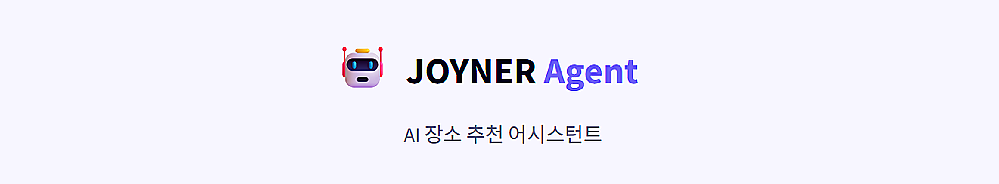
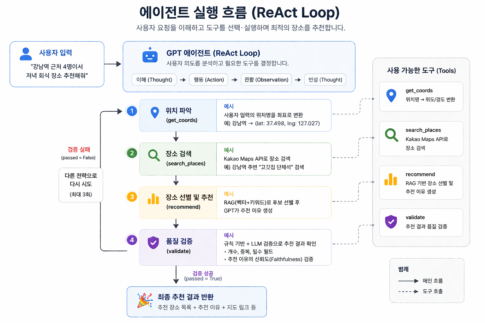
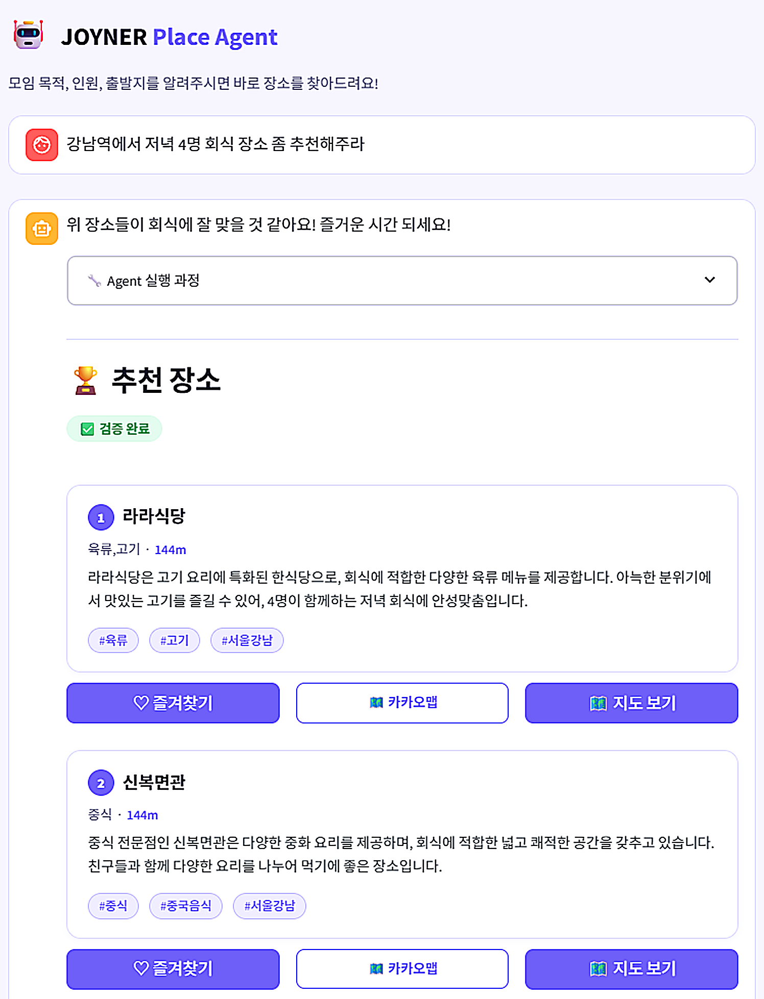
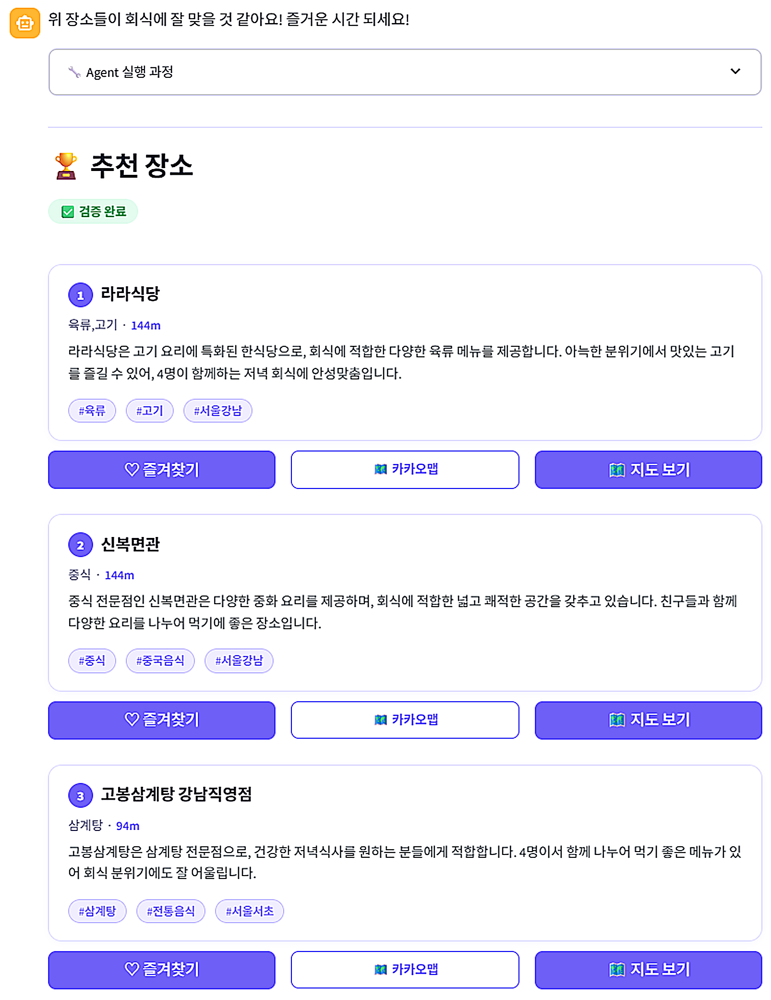
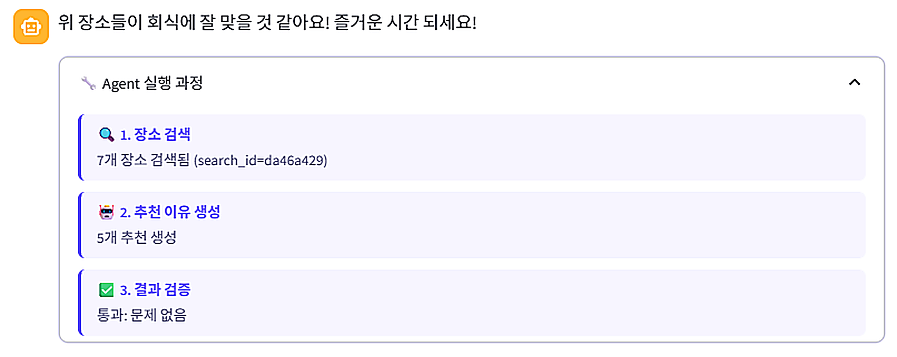

# JOYNER Place — Single Agent 버전

> OpenAI Function Calling 기반 ReAct 에이전트로 장소를 추천합니다.

<p align="center">
  
</p>

<p align="center">
  
  
  
  
</p>

---

## 소개

Single Agent 버전은 **하나의 GPT 에이전트**가 도구를 선택·실행하며 장소 추천을 완성하는 구조입니다.

사용자가 채팅으로 "홍대 근처 3명이서 브런치 먹을 곳 추천해줘"라고 입력하면, 에이전트가 스스로 필요한 도구를 판단하고 반복 호출해 결과를 생성합니다.

<p align="center">
  
</p>

---

## 동작 방식 (ReAct 패턴)

```
사용자 입력
    │
    ▼
┌───────────────────────────────────────────────────┐
│                  GPT (ReAct Loop)                  │
│                                                    │
│  Thought → Action → Observation → Thought → ...   │
│                                                    │
│  ┌──────────────────────────────────────────────┐ │
│  │              Available Tools                 │ │
│  │  • get_coords     위치명 → 위도/경도 변환      │ │
│  │  • search_places  Kakao API 장소 검색         │ │
│  │  • recommend      RAG 기반 장소 선별           │ │
│  │  • validate       추천 결과 품질 검증          │ │
│  └──────────────────────────────────────────────┘ │
└─────────────────┬─────────────────────────────────┘
                  │ 검증 통과 or 최대 재시도(3회) 도달
                  ▼
            최종 추천 결과 반환
```

### 실행 흐름

1. **Thought** — GPT가 사용자 요청을 분석하고 필요한 도구를 결정합니다.
2. **Action** — `get_coords` → `search_places` → `recommend` 순서로 도구를 호출합니다.
3. **Observation** — 도구 실행 결과를 GPT 컨텍스트에 추가합니다.
4. **검증** — `validate` 도구로 추천 품질을 확인합니다.
5. **재시도** — 검증 실패 시 다른 전략으로 최대 3회 재시도합니다.

<p align="center">
  
</p>

---

## 구조

```
agent/
├── backend/
│   ├── main.py          # FastAPI 앱 (port 8001)
│   ├── agent.py         # ReAct 에이전트 루프
│   ├── tools.py         # 도구 정의 (Function Calling 스키마)
│   ├── kakao.py         # Kakao Maps API 클라이언트
│   ├── retrieval.py     # RAG 파이프라인 (FAISS + BM25)
│   ├── validation.py    # 추천 결과 검증
│   └── auth.py          # JWT 인증
└── frontend/
    └── app.py           # Streamlit 채팅 UI (port 8502)
```

---

## 핵심 코드

### Function Calling 도구 스키마

에이전트가 호출할 수 있는 도구는 OpenAI Function Calling 형식으로 정의됩니다.

```python
tools = [
    {
        "type": "function",
        "function": {
            "name": "search_places",
            "description": "Kakao Maps API로 장소를 검색합니다.",
            "parameters": {
                "type": "object",
                "properties": {
                    "query": {"type": "string"},
                    "x": {"type": "number"},
                    "y": {"type": "number"},
                    "radius": {"type": "integer"},
                },
                "required": ["query", "x", "y"],
            },
        },
    },
    # ... recommend, validate, get_coords
]
```

### 검증 로직

```python
# 규칙 기반 검증
checks = {
    "has_enough_results": len(recommendations) >= 3,
    "no_duplicates":      len(set(r["place_name"] for r in recommendations)) == len(recommendations),
    "has_required_fields": all(r.get("place_url") for r in recommendations),
}

# LLM 기반 신뢰도(Faithfulness) 검증
# 추천 이유가 실제 장소 데이터에 근거하는지 확인
```

---

## API 명세

### `POST /agent/chat`

자연어 메시지를 입력받아 장소를 추천합니다.

**Request**
```json
{
  "message": "강남역 근처 4명이서 저녁 회식 장소 추천해줘",
  "session_id": "abc-123",
  "conversation_history": []
}
```

**Response**
```json
{
  "reply": "강남역 근처 4명 회식에 딱 맞는 장소들을 찾았어요!",
  "complete": true,
  "recommendations": [
    {
      "place_name": "OOO 한식당",
      "category": "한식",
      "address": "서울 강남구 ...",
      "distance": "320",
      "place_url": "https://place.map.kakao.com/...",
      "reason": "단체석이 넓고 회식 분위기에 적합합니다.",
      "tags": ["단체석", "회식", "주차 가능"],
      "lat": 37.498,
      "lng": 127.027
    }
  ],
  "tool_calls": ["get_coords", "search_places", "recommend", "validate"],
  "retry_count": 0
}
```

### `POST /auth/login`

```json
{ "username": "user", "password": "pass" }
→ { "access_token": "eyJ...", "token_type": "bearer" }
```

---

## 설치 및 실행

### Docker (권장)

```bash
# 프로젝트 루트에서
docker-compose up agent-backend agent-frontend
```

### 로컬 실행

```bash
# 백엔드
cd agent/backend
pip install -r requirements.txt
uvicorn main:app --reload --port 8001

# 프론트엔드 (새 터미널)
cd agent/frontend
streamlit run app.py --server.port 8502
```

### 환경 변수

```env
OPENAI_API_KEY=sk-...
KAKAO_REST_API_KEY=...
SECRET_KEY=your-jwt-secret
```

---

## 스크린샷

### 채팅 인터페이스

<p align="center">
  
</p>

### 추천 결과 카드

<p align="center">
  
</p>

### 에이전트 도구 실행 로그

<p align="center">
  
</p>

---

## Multi-Agent 버전과 비교

| 항목 | Single Agent | Multi-Agent |
|------|-------------|-------------|
| **구조** | GPT가 도구를 자율 선택 | 4개 전문 에이전트 순차 실행 |
| **유연성** | 높음 (동적 도구 선택) | 낮음 (고정 파이프라인) |
| **예측 가능성** | 낮음 | 높음 |
| **디버깅** | 어려움 | 쉬움 (단계별 로그) |
| **응답 속도** | 빠름 (단순 요청) | 느림 (복잡한 요청에 강점) |
| **재시도 전략** | 에이전트 자체 판단 | 오케스트레이터 제어 |

---

[← 전체 프로젝트로 돌아가기](../README.md) | [Multi-Agent 버전 보기](../multi_agent/README.md)
