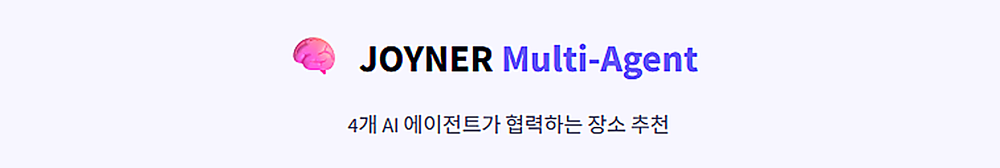
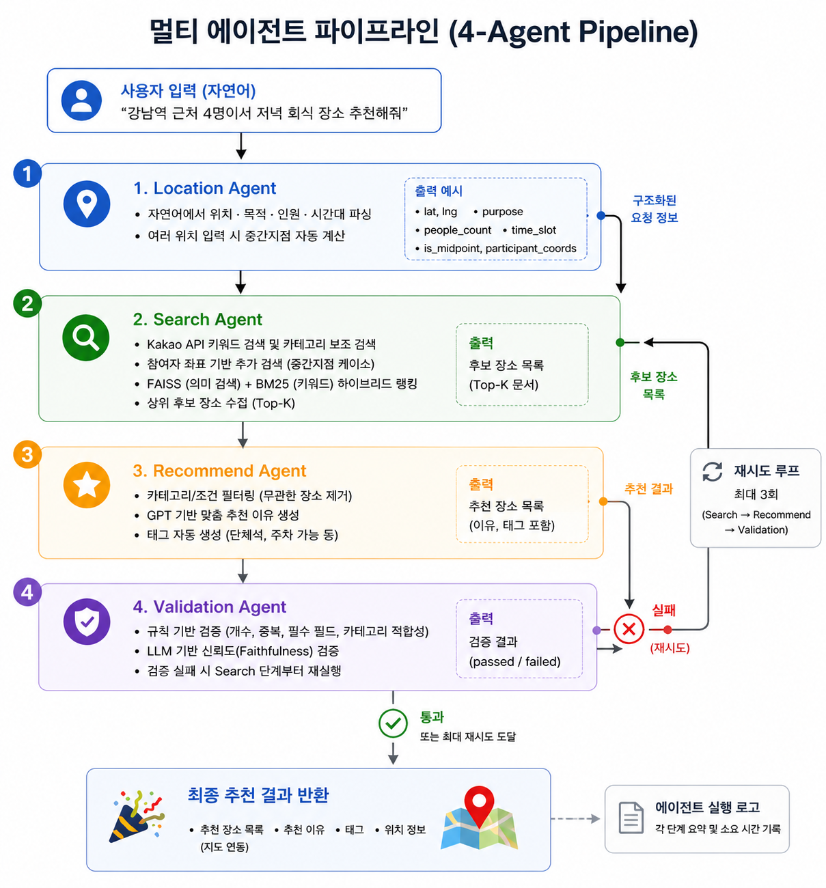
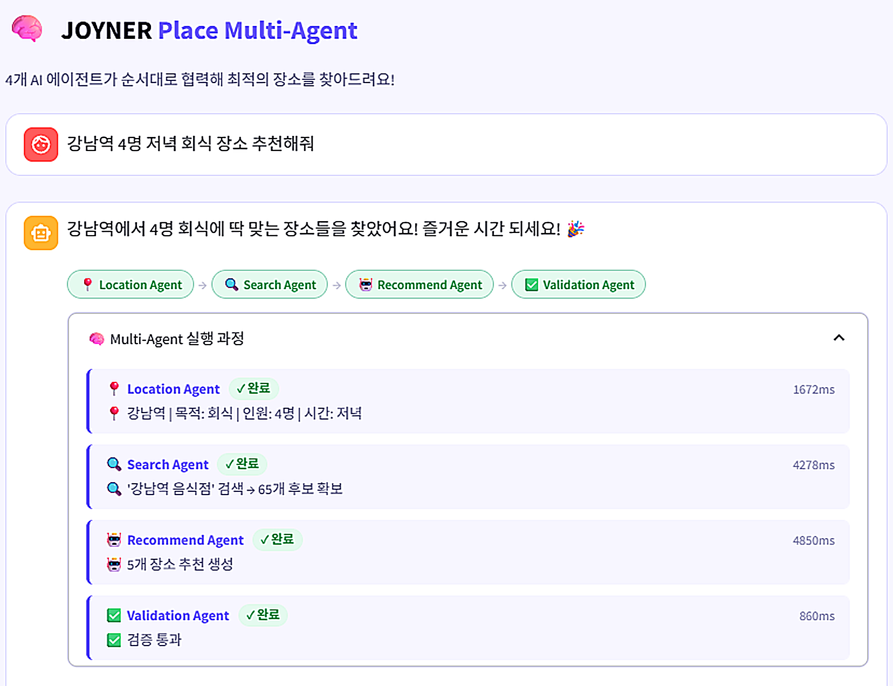
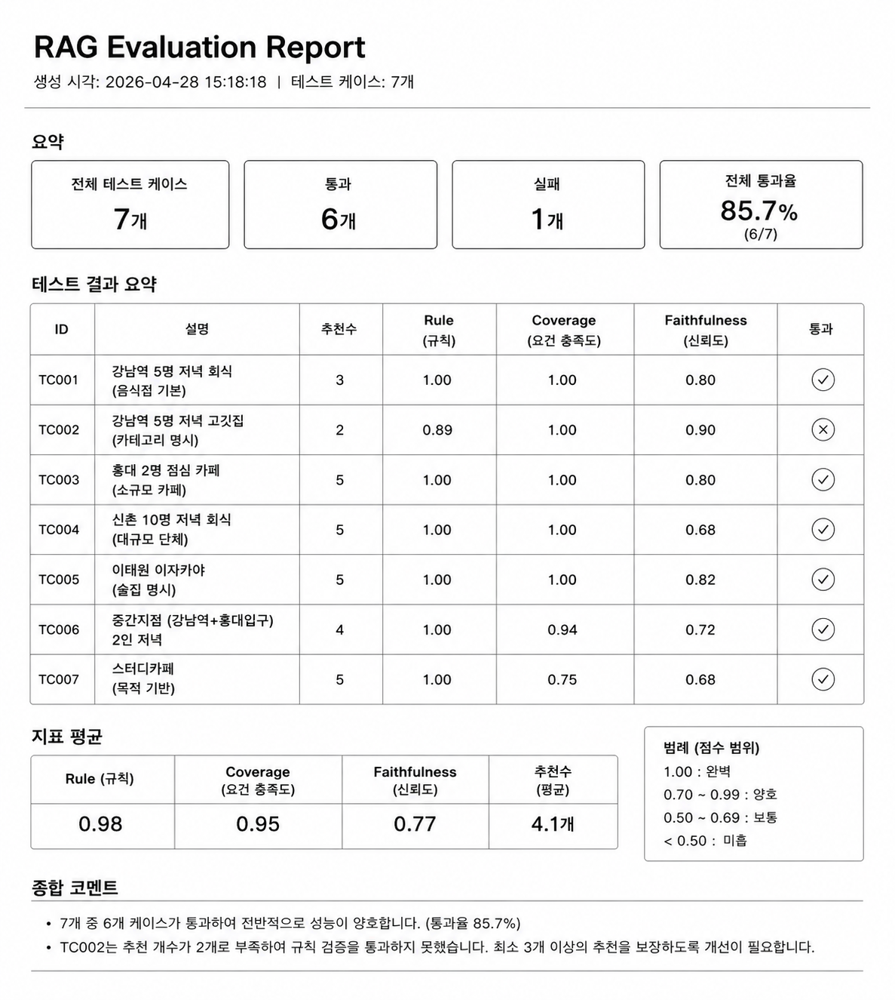
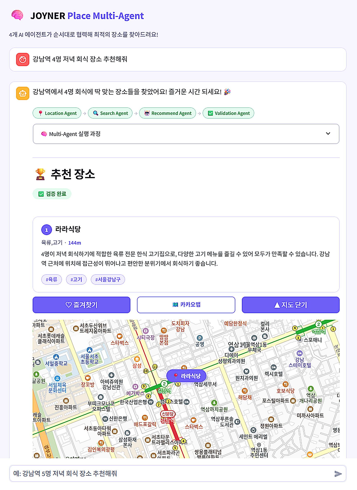
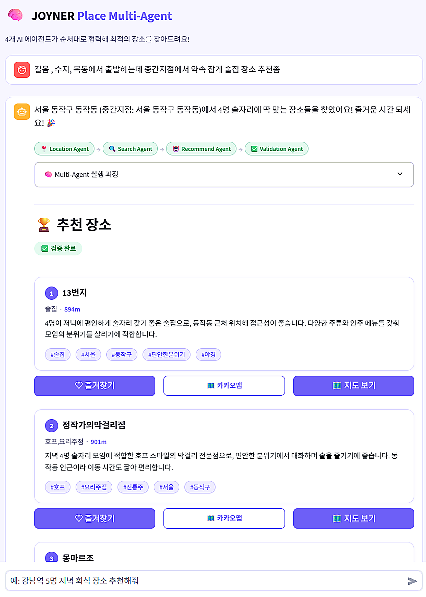

# JOYNER Place — Multi-Agent 버전

> 4개의 전문 에이전트가 협업하는 파이프라인으로 최적의 장소를 추천합니다.

<p align="center">
  
</p>

<p align="center">
  
  
  
  
  
</p>

---

## 소개

Multi-Agent 버전은 **4개의 전문 에이전트**가 역할을 분담해 협업하는 구조입니다.

각 에이전트는 하나의 책임만 가지며, 오케스트레이터가 순서를 제어합니다. 검증 실패 시 Search → Recommend → Validate 단계를 최대 3회 재시도합니다.

<p align="center">
  
</p>

---

## 4-에이전트 파이프라인

```
사용자 입력 (자연어)
        │
        ▼
┌───────────────────────────────────────────────────────┐
│  1. Location Agent                                    │
│     자연어에서 위치 · 목적 · 인원 · 시간대 파싱          │
│     여러 위치 입력 시 중간지점 자동 계산                 │
└──────────────────────────┬────────────────────────────┘
                           │ lat, lng, purpose, people, time_slot
                           ▼
┌───────────────────────────────────────────────────────┐
│  2. Search Agent                          ┌─────────┐ │
│     Kakao API 키워드 검색                  │  재시도  │ │
│     카테고리 코드 보조 검색                 │  루프   │ │
│     FAISS(의미 검색) + BM25(키워드) 하이브리드 랭킹    │ │
│     중간지점 케이스: 참여자 좌표에서 추가 검색 │         │ │
└──────────────────────────┬────────────────┘         │ │
                           │ top-K 후보 문서            │ │
                           ▼                           │ │
┌───────────────────────────────────────────────────────┐ │
│  3. Recommend Agent                                   │ │
│     카테고리 필터링 (고깃집/술집/카페 등)               │ │
│     GPT로 맞춤 추천 이유 생성                          │ │
│     태그 자동 생성                                    │ │
└──────────────────────────┬────────────────────────────┘ │
                           │ recommendations              │ │
                           ▼                              │ │
┌───────────────────────────────────────────────────────┐ │
│  4. Validation Agent                                  │ │
│     규칙 기반: 개수 · 중복 · 필수 필드 확인            │ │
│     LLM 기반: 추천 이유 신뢰도(Faithfulness) 검증      │─┘ │
│     passed=False & 재시도 가능 → Search부터 재실행     │   │
└──────────────────────────┬────────────────────────────┘   │
                           │ passed=True or 최대 재시도 도달  │
                           ▼                                │
                    최종 추천 결과 반환 ◄──────────────────────┘
```

<p align="center">
  
</p>

---

## 구조

```
multi_agent/
├── backend/
│   ├── main.py                  # FastAPI 앱 (port 8003)
│   ├── orchestrator.py          # 에이전트 실행 제어, 재시도 로직
│   ├── tools.py                 # 공유 도구 (Kakao API, RAG, 유틸)
│   ├── agents/
│   │   ├── location_agent.py    # 위치 파싱 & 지오코딩
│   │   ├── search_agent.py      # Kakao 검색 + RAG 파이프라인
│   │   ├── recommend_agent.py   # GPT 추천 이유 생성
│   │   └── validation_agent.py  # 규칙 + LLM 검증
│   └── prompts/
│       ├── location_agent_prompt.txt
│       ├── search_agent_prompt.txt
│       ├── recommend_agent_prompt.txt
│       └── validation_agent_prompt.txt
├── frontend/
│   └── app.py                   # Streamlit 채팅 UI (port 8503)
├── data/
│   ├── favorites.json           # 즐겨찾기 (영구 저장)
│   └── conversations.json      # 대화 기록
└── evaluation/
    ├── run_evaluation.py        # 평가 실행 스크립트
    ├── testset.json             # 테스트 케이스
    └── evaluators/
        ├── retrieval_eval.py    # Precision@K, Recall@K
        ├── faithfulness_eval.py # 추천 이유 신뢰도
        ├── coverage_eval.py     # 요건 충족도
        └── rule_eval.py         # 규칙 기반 검증
```

---

## 에이전트 상세

### 1. Location Agent

자연어 입력에서 구조화된 위치 정보를 추출합니다.

```
입력: "강남역이랑 홍대입구 중간에서 5명이서 저녁 회식"

출력:
{
  "lat": 37.5183,  "lng": 126.9741,   # 중간지점 좌표
  "location_name": "공덕역 인근",
  "purpose": "회식",
  "time_slot": "저녁",
  "people_count": 5,
  "is_midpoint": true,
  "participant_coords": [
    {"lat": 37.498, "lng": 127.027, "label": "강남역"},
    {"lat": 37.557, "lng": 126.923, "label": "홍대입구역"}
  ]
}
```

### 2. Search Agent

Kakao Maps API + RAG 파이프라인으로 장소 후보를 수집합니다.

**하이브리드 검색 전략**

```
Kakao 키워드 검색 (1차)
    ↓ 결과 < 10개
반경 2× 확장 검색
    ↓ 특정 카테고리 (고깃집/이자카야 등)
다중 쿼리 보조 검색
    ↓ 중간지점 케이스
참여자 좌표별 보조 검색
    ↓
FAISS(의미 검색) + BM25(키워드) 하이브리드 랭킹
    ↓
상위 10~15개 후보 반환
```

### 3. Recommend Agent

GPT가 후보 목록에서 최적 장소를 선별하고 추천 이유를 생성합니다.

- 카테고리 필터링으로 무관한 장소(카페, 편의점 등) 사전 제거
- 인덱스 번호 기반 출력으로 GPT 환각 방지
- 각 장소에 2~3문장의 맞춤형 추천 이유 생성
- 자동 태그 생성 (단체석, 주차 가능, 야외석 등)

### 4. Validation Agent

추천 결과의 품질을 두 단계로 검증합니다.

```python
# 규칙 기반 검증
checks = {
    "has_enough_results":  len(recommendations) >= 3,
    "no_duplicates":       중복 장소 없음,
    "has_required_fields": place_url, lat, lng 존재,
    "category_relevance":  목적과 카테고리 일치,
}

# LLM 기반 검증
# 추천 이유가 실제 장소 데이터(카테고리, 주소)에 근거하는지 확인
# 근거 없는 내용(환각) 탐지
```

---

## 에이전트 로그

응답에 포함되는 `agent_log`로 각 단계의 실행 내역을 추적할 수 있습니다.

```json
"agent_log": [
  {
    "agent": "Location Agent",
    "status": "done",
    "summary": "📍 강남역 | 목적: 회식 | 인원: 5명 | 시간: 저녁",
    "duration_ms": 842
  },
  {
    "agent": "Search Agent",
    "status": "done",
    "summary": "🔍 '강남역 고깃집 단체석' 검색 → 34개 후보 확보",
    "duration_ms": 3201
  },
  {
    "agent": "Recommend Agent",
    "status": "done",
    "summary": "🤖 5개 장소 추천 생성",
    "duration_ms": 4512
  },
  {
    "agent": "Validation Agent",
    "status": "done",
    "summary": "✅ 검증 통과",
    "duration_ms": 1823
  }
]
```

<p align="center">
  
</p>

---

## API 명세

### `POST /chat`

**Request**
```json
{
  "message": "강남역 근처 5명 저녁 고깃집 추천해줘",
  "session_id": "session-abc",
  "conversation_history": []
}
```

**Response**
```json
{
  "reply": "강남역에서 5명 회식에 딱 맞는 장소들을 찾았어요! 즐거운 시간 되세요! 🎉",
  "complete": true,
  "recommendations": [
    {
      "place_name": "OOO 갈비",
      "category": "갈비",
      "address": "서울 강남구 역삼동 ...",
      "distance": "450",
      "place_url": "https://place.map.kakao.com/...",
      "reason": "단체석이 넉넉하고 고기 품질이 우수합니다. 강남역에서 도보 5분 거리입니다.",
      "tags": ["단체석", "고기구이", "주차 가능"],
      "lat": 37.499,
      "lng": 127.028
    }
  ],
  "validation_result": { "passed": true, "score": 0.92, "issues": [] },
  "agent_log": [ ... ],
  "midpoint": null,
  "midpoint_lat": null,
  "midpoint_lng": null,
  "participant_coords": [],
  "retry_count": 0
}
```

### `GET /favorites`
### `POST /favorites`
### `DELETE /favorites/{place_name}`
### `PUT /favorites/{place_name}/memo`

---

## 평가 시스템

자동화된 평가 파이프라인으로 추천 품질을 수치화합니다.

### 평가 지표

| 지표 | 설명 |
|------|------|
| **Precision@K** | 상위 K개 결과 중 정답 비율 |
| **Recall@K** | 정답 중 상위 K개에 포함된 비율 |
| **Faithfulness** | 추천 이유가 실제 장소 데이터에 근거하는 비율 |
| **Coverage** | 위치 근접성 · 카테고리 · 인원 · 시간대 요건 충족도 |
| **Rule Score** | 형식 · 개수 · 중복 등 규칙 기반 점수 |

### 평가 실행

```bash
cd multi_agent/evaluation

# 백엔드 API 호출로 평가
python run_evaluation.py --mode api --url http://localhost:8003 --token <JWT>

# 특정 케이스만 평가
python run_evaluation.py --mode api --filter TC001,TC002

# 결과 파일로 평가
python run_evaluation.py --mode file --results ./results/result.json
```

### 평가 결과 예시

```
📋 테스트 케이스 8개 로드

[TC001] 단일 위치 저녁 식사
  Rule  : ✅ score=1.00
  Retrieval P@10=0.80 R@10=0.60
  Coverage overall=0.85
  Faithfulness avg=0.88

[TC002] 강남역 5명 저녁 고깃집
  Rule  : ✅ score=1.00
  Coverage overall=0.92

✅ 평가 완료: 7/8 통과 (87.5%)
```

<p align="center">
  
</p>

---

## 설치 및 실행

### Docker (권장)

```bash
# 프로젝트 루트에서
docker-compose up multi-agent-backend multi-agent-frontend
```

### 로컬 실행

```bash
# 백엔드
cd multi_agent/backend
pip install -r requirements.txt
uvicorn main:app --reload --port 8003

# 프론트엔드 (새 터미널)
cd multi_agent/frontend
streamlit run app.py --server.port 8503
```

### 환경 변수

```env
OPENAI_API_KEY=sk-...
KAKAO_REST_API_KEY=...
SECRET_KEY=your-jwt-secret
```

---

## 스크린샷

### 채팅 인터페이스

<p align="center">
  
</p>

### 추천 결과 카드

<p align="center">
  
</p>

### 카카오 지도 통합

<p align="center">
  
</p>

### 에이전트 실행 로그 (사이드바)

<p align="center">
  
</p>

### 중간지점 추천

<p align="center">
  
</p>

---

## Single Agent 버전과 비교

| 항목 | Single Agent | Multi-Agent |
|------|-------------|-------------|
| **구조** | GPT가 도구를 자율 선택 | 4개 전문 에이전트 순차 실행 |
| **유연성** | 높음 (동적 도구 선택) | 낮음 (고정 파이프라인) |
| **예측 가능성** | 낮음 | 높음 |
| **디버깅** | 어려움 | 쉬움 (단계별 로그) |
| **카테고리 필터** | 없음 | 고깃집/술집/카페 등 세밀한 필터 |
| **중간지점** | 기본 지원 | 참여자 좌표 보조 검색 포함 |
| **평가 시스템** | 기본 | 4개 지표 자동화 평가 |
| **재시도 전략** | 에이전트 자체 판단 | 오케스트레이터 제어 |

---

[← 전체 프로젝트로 돌아가기](../README.md) | [Single Agent 버전 보기](../agent/README.md)
